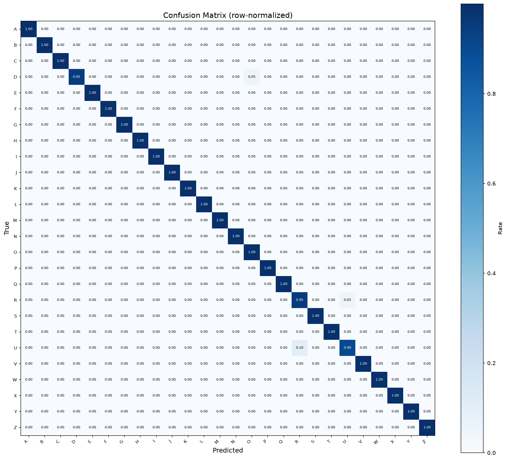

# Hand Sign Detection

<div align="center">


**Local real-time ASL alphabet recognition using MediaPipe landmarks and a compact PyTorch Transformer.**

[Portfolio site](https://usmanbutt-dev.github.io/hand-sign-detection/) · [Architecture](#architecture) · [Run locally](#run-locally) · [Results](#results)

</div>

## Overview

The application recognizes 26 isolated ASL alphabet signs from a webcam or image. MediaPipe converts a detected hand into 21 three-dimensional landmarks; wrist-relative normalization removes position and scale; a 404K-parameter Transformer classifies the resulting geometry.

Inference runs locally. Camera frames are not uploaded, and GitHub Pages is an informational project site rather than a hosted inference service.

## Results

The final checkpoint was selected using validation loss and evaluated once on a held-out, stratified test split.

| Metric | Result |
|---|---:|
| Dataset | 10,508 samples |
| Classes | 26 (A–Z) |
| Test samples | 526 |
| Test accuracy | **99.24%** |
| Test loss | 0.1060 |
| Best epoch | 45 |
| Parameters | 404,250 |
| CPU training time | 13.7 minutes |



Metrics are stored in [`artifacts/classifier_metrics.json`](artifacts/classifier_metrics.json). The versioned checkpoint includes its architecture, ordered labels, normalization identifier, validation metrics, and weights.

## Architecture

```text
Webcam frame or image
        │
        ▼
MediaPipe Hand Landmarker
        │ 21 landmarks × (x, y, z)
        ▼
Wrist-relative, scale-invariant normalization
        │ 63 values
        ▼
PyTorch Transformer encoder
        │ probabilities for A–Z
        ▼
Confidence filter + temporal smoothing
        │
        ▼
Streamlit interface or OpenCV webcam window
```

The repository retains the earlier YOLO dataset and training experiment, but the finished runtime uses MediaPipe directly because no trained YOLO hand-detector checkpoint is required.

## Run locally

Requirements: Python 3.11+, [uv](https://docs.astral.sh/uv/), and a webcam for live mode.

```bash
git clone https://github.com/usmanbutt-dev/hand-sign-detection.git
cd hand-sign-detection

uv sync --extra dev
uv run streamlit run src/ui/streamlit_app.py
```

Open the URL printed by Streamlit. The committed classifier checkpoint is ready to use. MediaPipe downloads its approximately 8 MB hand-landmarker asset on first use if it is absent.

For the lower-overhead OpenCV interface:

```bash
uv run python -m src.inference.realtime
```

Use another camera index when needed:

```bash
uv run python -m src.inference.realtime --camera 1
```

## Train the classifier

The processed CSV is intentionally not stored in Git because it is approximately 13 MB. Follow the data preparation commands below when reproducing training from source.

```bash
# Download/prepare the landmark data
uv run python scripts/run_prepare.py

# Train, evaluate, and generate artifacts
uv run python -m src.training.train_classifier \
  --epochs 50 --batch 256 --size small --patience 10
```

Training writes the checkpoint, JSON metrics, confusion matrix, training curve, and a local MLflow run.

```bash
uv run mlflow ui --port 5000
```

## Tests and quality checks

```bash
uv run ruff check .
uv run pytest -q
uv run pytest --cov=src --cov-report=term-missing
```

CI runs linting and the complete test suite on every branch push and pull request.

## Project structure

```text
artifacts/                      measured evaluation outputs
configs/config.yaml             data, model, training, and inference settings
docs/                           GitHub Pages portfolio site
models/hand_sign_transformer.pt trained self-describing checkpoint
src/data/                       collection, preparation, and landmark extraction
src/models/transformer.py       landmark Transformer and checkpoint contract
src/training/train_classifier.py training, evaluation, MLflow, and artifacts
src/inference/                  shared predictor and OpenCV live loop
src/ui/streamlit_app.py         local interactive interface
tests/                          unit and integration tests
```

## Limitations

- The classifier handles isolated static signs, not continuous signing or sentence translation.
- ASL letters J and Z involve motion. Their dataset representations are static approximations, so the full gestures are not modeled.
- Only the first detected hand is classified.
- Reported accuracy measures the held-out landmark dataset; live results depend on camera angle, visibility, and distribution shift.

## Roadmap

- [x] **Phase 1** — project scaffold, Git workflow, and CI
- [x] **Phase 2** — data pipeline and 10,508 landmark samples
- [x] **Phase 3** — YOLO data/training experiment and MLflow support
- [x] **Phase 4** — MediaPipe offline and live landmark extraction
- [x] **Phase 5** — PyTorch Transformer training and held-out evaluation
- [x] **Phase 6** — shared local real-time inference pipeline
- [x] **Phase 7** — Streamlit and OpenCV local demos
- [x] **Phase 8** — portfolio site, measured results, and documentation

## Author

**Muhammad Usman Butt** — [@usmanbutt-dev](https://github.com/usmanbutt-dev)

Built as a portfolio project for AI/ML engineering roles.

## License

MIT — see [LICENSE](LICENSE).
